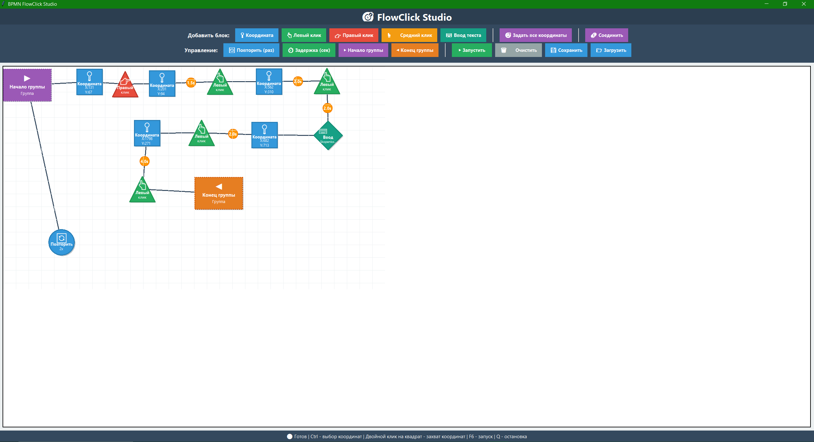

# 🎯 FlowClick Studio

**Visual BPMN-style automation tool for mouse clicks and keyboard input**

FlowClick Studio is a powerful visual flow editor that allows you to create automated click sequences and keyboard inputs using a drag-and-drop interface inspired by BPMN (Business Process Model and Notation).




## ✨ Features

### 🔷 Block Types

- **📍 Coordinate Block** (Square) - Define screen coordinates
- **👆 Click Blocks** (Triangles) - Left, Right, Middle mouse clicks
- **⌨️ Keyboard Input** (Diamond) - Type text with Enter support
- **⏱️ Delay Block** (Green Circle) - Add pauses between actions
- **🔄 Repeat Block** (Blue Circle) - Loop actions N times
- **▶ Group Blocks** (Dashed Rectangles) - Organize flows into subprocesses

### 🎨 Visual Features

- **Drag & Drop** - Move blocks around the canvas
- **Connections** - Link blocks with arrows
- **Delay on Arrows** - Set timing between transitions (double-click arrow)
- **Grid Layout** - Organized workspace
- **Real-time Execution** - See your flow run live

### ⌨️ Keyboard Shortcuts

- **Ctrl** - Capture coordinates for selected coordinate block
- **F6** - Start/Stop execution
- **Q** - Emergency stop
- **Double-click** - Edit block parameters or arrow delays
- **Right-click** - Delete block

### 🚀 Quick Start

1. Add blocks from the toolbar
2. Drag blocks to position them
3. Click "🔗 Connect" and link blocks (click first, then second)
4. Double-click coordinate blocks to capture screen positions (or select + press Ctrl)
5. Double-click arrows to set delays between actions
6. Press "▶ Start" or **F6** to run your automation

### 📋 Example Flows

**Simple Click Automation:**
```
Coordinate (100, 200) → Left Click → [2s delay] → Coordinate (300, 400) → Left Click
```

**Form Fill with Repeat:**
```
Repeat 5x → Start Group
  → Coordinate → Click → Keyboard Input "Name"
  → Coordinate → Click → Keyboard Input "Email"
End Group
```

**Complex Automation:**
```
Start Group "Login Process"
  → Coordinate (login field) → Click
  → Keyboard Input "username" → [0.5s]
  → Coordinate (password field) → Click
  → Keyboard Input "password" → [0.5s]
  → Coordinate (submit button) → Click
End Group → [2s] → Repeat 3x → (next action)
```

## 📦 Installation

### Requirements

```bash
Python 3.8+
```

### Install Dependencies

```bash
pip install -r requirements.txt
```

### Dependencies List

- `pyautogui` - Mouse and keyboard automation
- `pillow` - Image processing
- `keyboard` - Hotkey support
- `pynput` - Input monitoring
- `pyperclip` - Clipboard operations

## 🎮 Usage

### Running the Application

```bash
python main.py
```

### Creating Your First Flow

1. **Add a Coordinate Block** - Click "📍 Координата"
2. **Select it** (left-click on the block)
3. **Capture coordinates** - Move your mouse where you want to click, press **Ctrl**
4. **Add a Click Block** - Click "👆 Левый клик"
5. **Connect them** - Click "🔗 Соединить", click coordinate block, then click block
6. **Run** - Press **F6** or click "▶ Запустить"

### Setting Delays

**On Connections:**
- Double-click any arrow between blocks
- Enter delay in seconds (e.g., 1.5)
- Orange circle with time will appear on the arrow

**Using Delay Blocks:**
- Add "⏱️ Задержка (сек)" block
- Set duration when adding or double-click to edit
- Place in your flow where pause is needed

### Batch Coordinate Setup

Use "🎯 Задать все координаты" to set multiple coordinates quickly:
1. Click the button
2. For each coordinate block:
   - Move mouse to desired position
   - Press **Ctrl**
   - Automatically moves to next block

### Keyboard Input

- Add "⌨️ Ввод текста" block
- Enter text in dialog
- Check "Нажать Enter после ввода" to auto-submit
- Supports any language (uses clipboard)

### Grouping Actions

Create reusable subprocesses:
1. Add "▶ Начало группы" (Start Group)
2. Add your action blocks
3. Add "◀ Конец группы" (End Group)
4. Connect with "🔄 Повторить" to repeat the entire group

## 💾 Saving & Loading

- **💾 Сохранить** - Save your flow to `vibe_click_config.json`
- **📂 Загрузить** - Load previously saved flow
- Auto-loads last saved flow on startup

## 🔧 Configuration

Flows are saved in JSON format at `vibe_click_config.json`:

```json
{
  "blocks": [
    {
      "id": 1,
      "type": "coordinate",
      "x": 100,
      "y": 50,
      "data": {"x": 500, "y": 300}
    }
  ],
  "connections": [
    {
      "from": 1,
      "to": 2,
      "delay": 1.5
    }
  ]
}
```

## 🛡️ Safety Features

- **Failsafe** - Move mouse to top-left corner to emergency stop
- **Q Key** - Emergency stop hotkey
- **Stop Button** - Click "⏸ Остановить" or press **F6** again

## 🎯 Use Cases

- **UI Testing** - Automate repetitive click sequences
- **Form Filling** - Batch data entry
- **Game Automation** - Repeated actions in games
- **Workflow Automation** - Streamline repetitive tasks
- **Demo Recording** - Create consistent demonstrations

## 🐛 Troubleshooting

**Text input not working?**
- Make sure the target field is focused before execution
- Check if clipboard is accessible
- Try with English text first to verify

**Coordinates not accurate?**
- Ensure screen scaling is 100% in Windows
- Recapture coordinates if window was moved
- Use absolute coordinates, not relative

**Execution too fast/slow?**
- Add delays on arrows (double-click arrow)
- Use delay blocks for longer pauses
- Adjust timing per connection

## 📄 License

MIT License - feel free to use and modify!

## 🤝 Contributing

Contributions welcome! Feel free to:
- Report bugs
- Suggest features
- Submit pull requests

## 👨‍💻 Author

Created with ❤️ for automation enthusiasts

---

**⚠️ Disclaimer:** Use responsibly. Some applications may have policies against automation tools.
